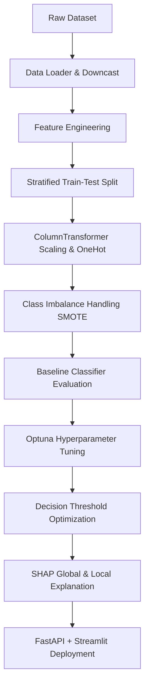

# Enterprise Financial Fraud Detection System 🛡️

A production-ready, modular, and highly scalable machine learning pipeline for real-time and batch financial fraud detection. The system features advanced feature engineering, automated class imbalance handling, hyperparameter optimization with Optuna, explainable AI using SHAP, a FastAPI REST service, and a Streamlit dashboard.

---

## 🚀 Key Features

* **Dynamic Data Loader**: Automatically detects, validates, and downcasts transaction datasets (e.g. 493MB PaySim) to save up to 70% RAM.
* **Domain Feature Engineering**: Extracts time features, balance discrepancies, merchant account indicators, and transactional velocity metrics.
* **Balanced Re-sampling Engine**: Compares SMOTE, SMOTEENN, Random Under-Sampling, and Class Weights to select the optimal model.
* **Multi-Model Classifier Registry**: Trains and logs Logistic Regression, Random Forest, XGBoost, LightGBM, and CatBoost using **MLflow**.
* **Automated Hyperparameter Tuning**: Optimizes the best classifier with **Optuna** using Stratified K-Fold cross-validation.
* **Threshold Optimizer**: Maximize F1-score to identify the optimal boundary for rare class detection.
* **Explainable AI (XAI)**: Provides global beeswarm/bar SHAP value charts and computes local waterfall charts on individual predictions.
* **High-Performance FastAPI Service**: Asynchronous endpoints for predictions, probabilities, batch CSV operations, and local SHAP explanations.
* **Interactive Streamlit Dashboard**: Dark-themed UI with gauge charts, file uploaders, API testers, and SHAP visualizers.
* **Docker Orchestration**: Containerized API and UI services deployable with a single Docker Compose command.

---

## 🛠️ Tech Stack

* **Language**: Python 3.12
* **Machine Learning**: Scikit-Learn, XGBoost, LightGBM, CatBoost, Imbalanced-Learn, Optuna
* **Data Science**: Pandas, NumPy
* **Explainability**: SHAP
* **Visualization**: Plotly, Matplotlib, Seaborn
* **Backend**: FastAPI, Pydantic, Uvicorn
* **Frontend**: Streamlit
* **MLOps / Logging**: MLflow, Loguru / RotatingFileHandler
* **Testing**: Pytest
* **Deployment**: Docker, Docker Compose, GitHub Actions

---

## 📂 Project Structure

```text
fraud-detection-system/
├── data/
│   ├── raw/                 # Raw dataset (paysim.csv)
│   └── processed/           # Processed train/test splits
├── config/
│   └── config.yaml          # Pipeline configuration (hyperparameters, paths, features)
├── src/
│   ├── preprocessing/       # Data loader, type downcaster, preprocessor pipelines
│   ├── feature_engineering/ # Time, balance error, and amount ratio extractions
│   ├── models/              # Imbalance handlers, model baseline trainers, Optuna tuners
│   ├── evaluation/          # Metrics, confusion matrices, ROC/PR curves, thresholds
│   ├── explainability/      # SHAP global and local waterfall generators
│   └── utils/               # Rotating file loggers
├── api/                     # FastAPI REST server & Pydantic schemas
├── dashboard/               # Multi-page Streamlit dashboard app
├── tests/                   # pytest unit and integration tests
├── artifacts/               # Saved models, pipelines, and evaluation plots
├── logs/                    # Runtime log files
├── Docker/                  # Dockerfiles and compose orchestrators
├── requirements.txt         # Project dependencies
├── README.md                # Project documentation
├── .env                     # Local environment variables
└── LICENSE                  # MIT License
```

---

## 📈 ML Pipeline Workflow



---

## ⚙️ Setup and Installation

### Prerequisite
* Python 3.12
* Docker (Optional, for containerized run)

### 1. Clone the repository and install dependencies
```powershell
# Clone the repository
git clone <repository_url>
cd fraud-detection-system

# Install dependencies
pip install -r requirements.txt
```

### 2. Move your Dataset
Ensure that the simulation CSV file (`paysim.csv`) is at the root directory or placed inside `data/raw/`. The data loader will automatically detect and move it if it's in the root.

### 3. Run the ML Pipeline
```powershell
# Run feature engineering, baseline training, and select the best model
python -m src.models.trainer

# Run Optuna hyperparameter optimization on the best model
python -m src.models.tune
```
Upon completion, models and evaluation plots will be generated in `artifacts/models/` and `artifacts/evaluation/` respectively.

---

## 🖥️ Running the Services

### Running Locally

1. **Start the FastAPI REST Server**:
   ```powershell
   uvicorn api.main:app --reload --port 8000
   ```
   * Open [http://localhost:8000/docs](http://localhost:8000/docs) to view the interactive Swagger API documentation.

2. **Start the Streamlit Dashboard**:
   ```powershell
   streamlit run dashboard/app.py
   ```
   * Open [http://localhost:8501](http://localhost:8501) in your browser.

---

### Running with Docker 🐳

Deploy the complete containerized application stack (API and Streamlit) with a single command:
```powershell
docker-compose -f Docker/docker-compose.yml up --build
```
* **API Endpoints**: `http://localhost:8000`
* **Streamlit UI**: `http://localhost:8501`

---

## 🧪 Running Automated Tests

Run the test suite to verify code functionality:
```powershell
# Run all tests
pytest tests/ -v
```

---

## 📡 API Endpoints Documentation

| Endpoint | Method | Description |
| :--- | :--- | :--- |
| `/` | GET | Return API operational status and loaded model version. |
| `/health` | GET | Check service health (returns `healthy` or `degraded`). |
| `/model-info` | GET | Return active model name, training strategy, and test metrics. |
| `/predict` | POST | Assess a single transaction JSON and return binary prediction. |
| `/predict-proba` | POST | Returns raw probability of fraud for a single transaction. |
| `/feature-importance` | GET | Return global feature importances of the active classifier. |
| `/shap` | POST | Generate SHAP value impacts for a single transaction. |
| `/batch-predict` | POST | Takes an uploaded CSV file, executes predictions, and returns list. |

### Prediction API Request Example
```bash
curl -X 'POST' \
  'http://localhost:8000/predict' \
  -H 'accept: application/json' \
  -H 'Content-Type: application/json' \
  -d '{
  "step": 1,
  "type": "TRANSFER",
  "amount": 181.0,
  "nameOrig": "C130548614",
  "oldbalanceOrg": 181.0,
  "newbalanceOrig": 0.0,
  "nameDest": "C553264065",
  "oldbalanceDest": 0.0,
  "newbalanceDest": 0.0
}'
```

---

## 🧑‍💻 Code Quality Standards

This project enforces clean code practices:
* **Formatting**: checked with `black`
* **Linting**: verified using `ruff`
* **Types checking**: strict checks using `mypy`

To format your code before pushing:
```powershell
black .
isort .
ruff check . --fix
```
